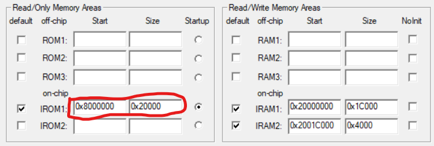
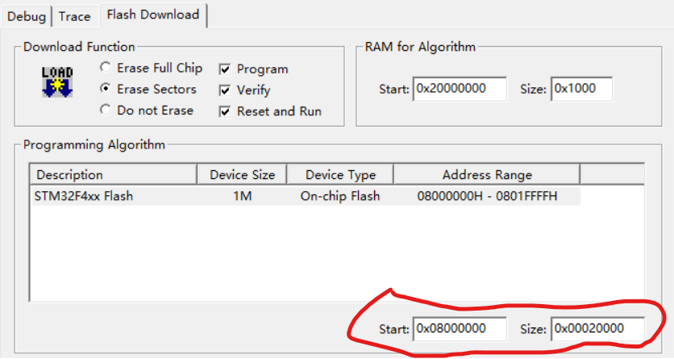
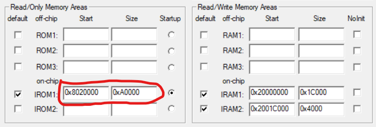
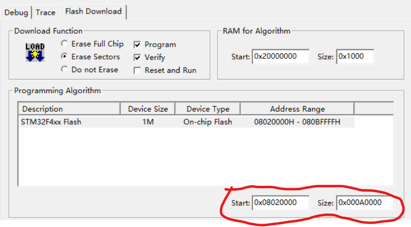

# Open-Link

Open-Link是一个具有野心的项目
其被设计出来主要为了解决设备间通信和OTA问题
包含以下部分
- Open Protocol
- Open Bootloader
- Uploader

## Open Protocol
开放协议

### 主要特性
- 无关硬件：定义在应用层，可以运行在UART、CAN、SPI、I2C、以太网、WIFI等任意物理链路中
- 路由机制：同一个设备可以绑定多个端口（如一个CAN，一个UART），协议通过链路中设备唯一ID来识别对方，如果通过CAN收到的消息识别到接收者并非自己，则会通过UART接口转发，实现消息的路由。
- 主动应答：可开启ACK，每个报文具有唯一的seq，可自动实现丢包补发，解决传输丢包问题。


## Open Bootloader(开发中)
简单易于移植的Bootloader

### 主要特性
- 支持 Open Protocol
- 底层抽象
### BOOTLOADER空间划分与设置
#### 空间划分
以RM C型开发板为例，STM32F407IG，容量1MB其FLASH空间如下
```C
/*
    STM32F407IG SECCTOR 1MB

    sector0   0x0800 0000 - 0x0800 3FFF   16K      bootloader   2 0000
    sector1   0x0800 4000 - 0x0800 7FFF   16K      |
    sector2   0x0800 8000 - 0x0800 BFFF   16K      |
    sector3   0x0800 C000 - 0x0800 FFFF   16K      |
    sector4   0x0801 0000 - 0x0801 FFFF   64K      | bootloader-end
    sector5   0x0802 0000 - 0x0803 FFFF   128K     app          A 0000
    sector6   0x0804 0000 - 0x0805 FFFF   128K     |
    sector7   0x0806 0000 - 0x0807 FFFF   128K     |
    sector8   0x0808 0000 - 0x0809 FFFF   128K     | app-end
    sector9   0x080A 0000 - 0x080B FFFF   128K     |
    ...
    sector10  0x080C 0000 - 0x080D FFFF   128K     params       2 0000
    sector11  0x080E 0000 - 0x080F FFFF   128K     |
*/
```
该划分方法中 bootloader 占用前128K

app 接着占用 640k

最后为系统变量留下256k的存储空间
因此再keil中有如下设置

#### bootloader MDK空间设置

Options->Target 选项卡：



Options->Debug，Jlink-Seetings, Flash Download 选项卡：



#### app MDK空间设置

Options->Target 选项卡：



Options->Debug，Jlink-Seetings, Flash Download 选项卡：




## Uploader

上位机工具

目前是一个命令行，基于python，可以通过串口实现对固件的下载
### 主要特性
- 下载固件
- 易于使用

### 例子
使用Tools进行串口OTA
``` sheel
python open_protocol_tool.py -d -p "COM3" -f "../examples/gd32f425rg/proj_app/app.bin"

                                                 __  __            __       
                                                |  \|  \          |  \
  ______    ______    ______   _______          | $$ \$$ _______  | $$   __
 /      \  /      \  /      \ |       \  ______ | $$|  \|       \ | $$  /  \r
|  $$$$$$\|  $$$$$$\|  $$$$$$\| $$$$$$$\|      \| $$| $$| $$$$$$$\| $$_/  $$
| $$  | $$| $$  | $$| $$    $$| $$  | $$ \$$$$$$| $$| $$| $$  | $$| $$   $$
| $$__/ $$| $$__/ $$| $$$$$$$$| $$  | $$        | $$| $$| $$  | $$| $$$$$$\
 \$$    $$| $$    $$ \$$     \| $$  | $$        | $$| $$| $$  | $$| $$  \$$\r
  \$$$$$$ | $$$$$$$   \$$$$$$$ \$$   \$$         \$$ \$$ \$$   \$$ \$$   \$$
          | $$
          | $$
           \$$
Options: {'port': 'COM6', 'fw_path': '../examples/gd32f425rg/proj_app/app.bin', 'reset': True, 'dst_addr': None, 'erase_bytes': 0, 'baud': 115200, 'debug': True}
--------------------------------------------------------------------------------------------------
Upgrade: Query version start
Upgrade: Module Addr:0x0206, APP:0x0101000d, BL:0x01010000, HW_ID:b'hD29334\x142251', SN:b'hD29334\x142251'
Upgrade: Query version end
Upgrade: 1 Module has been queried
Input your choose: Download all[y], exit[n], retry[r]:

```